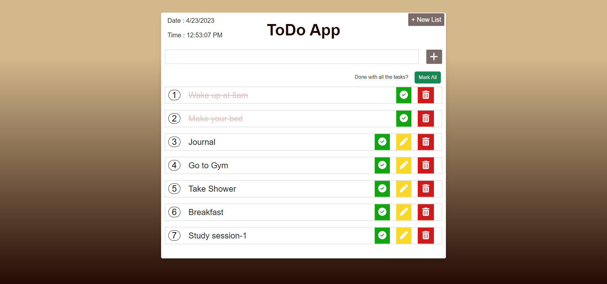
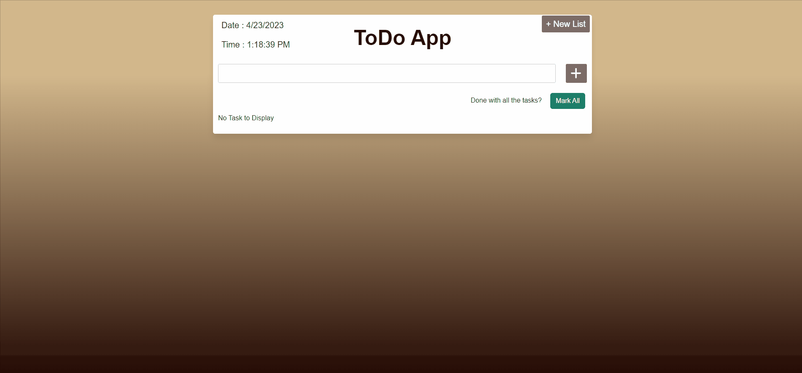

# ToDo App
> _by Saloni_

This wabpage titled My Task List is a simple to do app which supports the CRUD functionality, and it is made using React App.

 * ## Tech Stack

    
    
    
    
    

 * ## Knowledge Gained

   1. Building react project.
   2. Having fun with coding.

 * ## Output:

   

 * ## Functionality Added:

   1. User can add task in the todo list.
   2. User can view all their created todo tasks.
   3. User can edit their existing todo.
   4. User can delete their existing todo.
   5. User can mark their task as completed.
   6. User can also mark all the tasks as completed.
   7. User are able to create a new todo.
   8. User also get current Date & Time in the screen to monitor.

 * ## Functionality Demonstration:

   